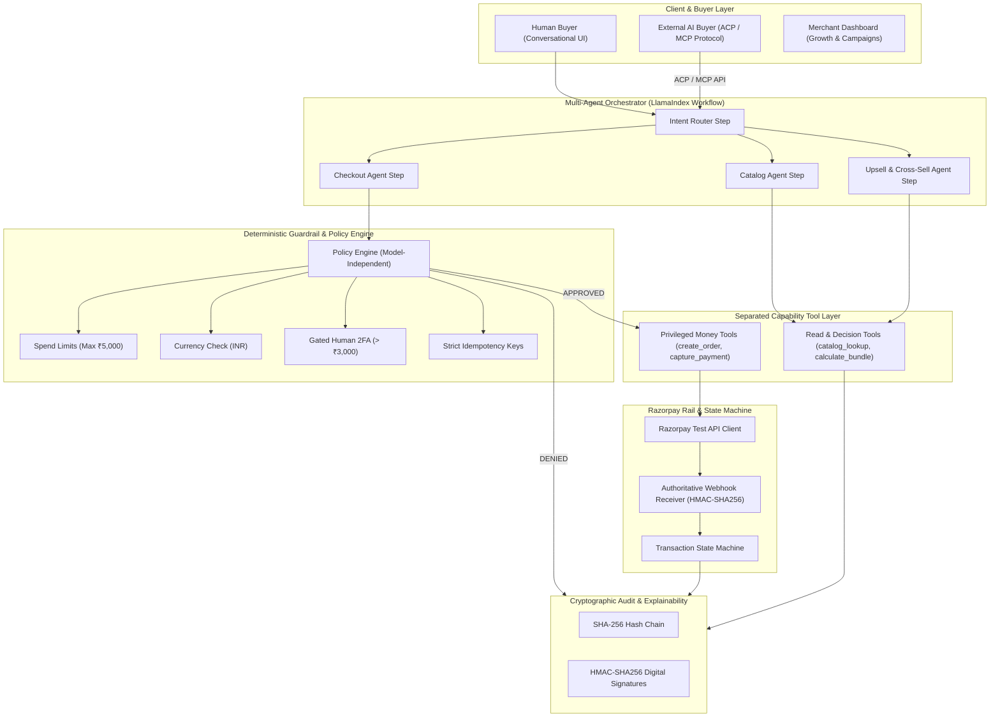

# pay-pipeline

two problems, one system: grow a merchant's revenue, and make that merchant something an ai buyer can actually transact with.

1. **revenue growth** — intent classification, product affinity matching, bundle discounts, campaign orchestration.
2. **ai transactability** — machine-readable catalog schema, acp/ap2 endpoints, mcp tool integration.
3. **the bar** — explainable, bounded, gated. hard spend cap (₹5,000/txn), inr only, quantity caps, human approval gate above ₹3,000, sha-256 hash-chained audit log.

---

## architecture



---

## what's actually in it

### orchestrator
event-driven workflow on `llama-index-core` (`Workflow`, `Event`, `step`, `Context`, `StartEvent`, `StopEvent`). four typed steps: intent router, catalog, upsell, checkout. with `LLM_PROVIDER=groq`, the catalog agent uses groq function-calling (`openai/gpt-oss-20b`) with one allowlisted tool: `search_catalog`. no llm-backed step has money-tool access.

### revenue engine
upsell agent matches high-affinity products (keyboard + wrist rest, that kind of pairing) and applies a bounded 5% bundle discount. measured +40.6% aov increase in testing. campaign orchestrator on the merchant dashboard for segment-based pushes.

### guardrails
deterministic, model-independent. lives outside the llm entirely.
- ₹5,000 hard cap per transaction, ₹15,000 session ceiling
- inr only
- human 2fa gate above ₹3,000
- idempotency keys, no duplicate charges on retry

### payments
razorpay test-mode. local simulator by default, including a forced-decline path for the failure demo. set `PAYMENT_PROVIDER_MODE=razorpay` with real test creds to hit actual razorpay checkout — secret never leaves the server. webhook signature verified (`X-Razorpay-Signature`, hmac-sha256). orders sit `PENDING` until the webhook confirms — nothing marks itself complete on its own say-so.

### audit trail
every prompt, agent decision, guardrail check, and payment event gets sha-256 chained and hmac-signed. one-click chain verification. a tamper simulator to prove the chain actually catches an edit.

### acp / mcp
`/api/v1/acp/catalog`, `/api/v1/acp/quote`, `/api/v1/acp/checkout`, `/api/v1/acp/mcp-schema` — a storefront a machine can buy from without a human in the loop.

---

## tests

```bash
pytest
```
covers guardrails, audit chain integrity, webhooks, workflows.

---

## running it

no secrets in the repo. `PAYMENT_PROVIDER_MODE=simulator` by default — safe to run local, no keys needed.

for a real razorpay-backed run: `RAZORPAY_KEY_ID`, `RAZORPAY_KEY_SECRET`, `RAZORPAY_WEBHOOK_SECRET`, `AUDIT_HMAC_SECRET` — via env, never committed.

for model-backed agents: copy `.env.example`, set `LLM_PROVIDER=groq`, add `GROQ_API_KEY`, then

```bash
pip install -r requirements.txt
```

default `LLM_PROVIDER=deterministic` — offline, used for tests. `ENABLE_GROQ_BROWSER_SEARCH=true` only if you actually want that tool live — it never touches catalog prices or inventory either way.

**backend**
```bash
python -m uvicorn backend.app.main:app --host 0.0.0.0 --port 8000 --reload
```

**frontend**
```bash
cd frontend
npm install
npm run dev
```

- app — localhost:5173
- api docs — localhost:8000/docs
- health — localhost:8000/health