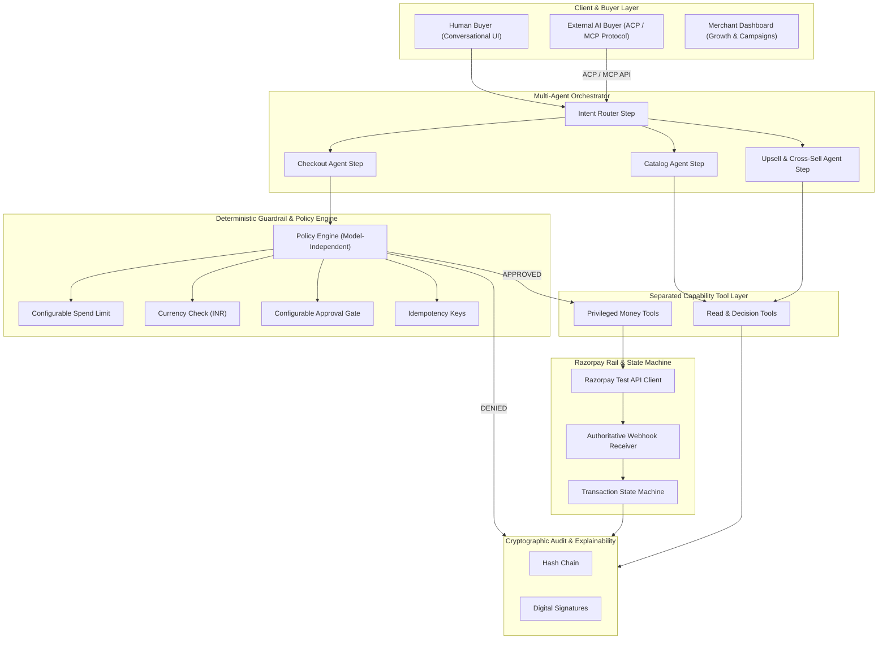

# pay-pipeline

an agent system built on razorpay test-mode apis, built to do two things: grow a merchant's revenue, and make that merchant transactable by an ai buyer end to end.

every money-moving action passes through a guardrail before it reaches razorpay — bounded by configurable limits, gated behind approval where required, and logged into a tamper-evident audit trail. nothing executes because a model decided to.

---

## architecture

---

## implementation

### client layer
human buyers, external ai buyers over acp/mcp, and the merchant dashboard all enter through the same intent router — one entry point regardless of who's asking.

### orchestrator
an event-driven workflow splits every incoming request into typed steps: intent routing, catalog lookup, upsell/cross-sell, checkout. none of these steps holds access to a money tool directly — they can only reach the guardrail.

### guardrail & policy engine
sits between the orchestrator and the money tools, independent of any model. checks spend limits, currency, approval requirements, and idempotency before anything is allowed through. limits are configurable, not hardcoded — set by the merchant, not baked into the code.

### tool layer
split by privilege. read/decision tools handle catalog and bundling logic and never touch money. money tools create orders and capture payments, and only unlock once the guardrail approves the request.

### payment layer
a razorpay test-mode client paired with an authoritative webhook receiver. an order stays pending until the webhook confirms it — the system never marks a payment complete on its own.

### audit layer
every decision, guardrail check, and payment event gets hash-chained and signed. tampering is detectable, and every action taken by the system can be traced back to why it happened.