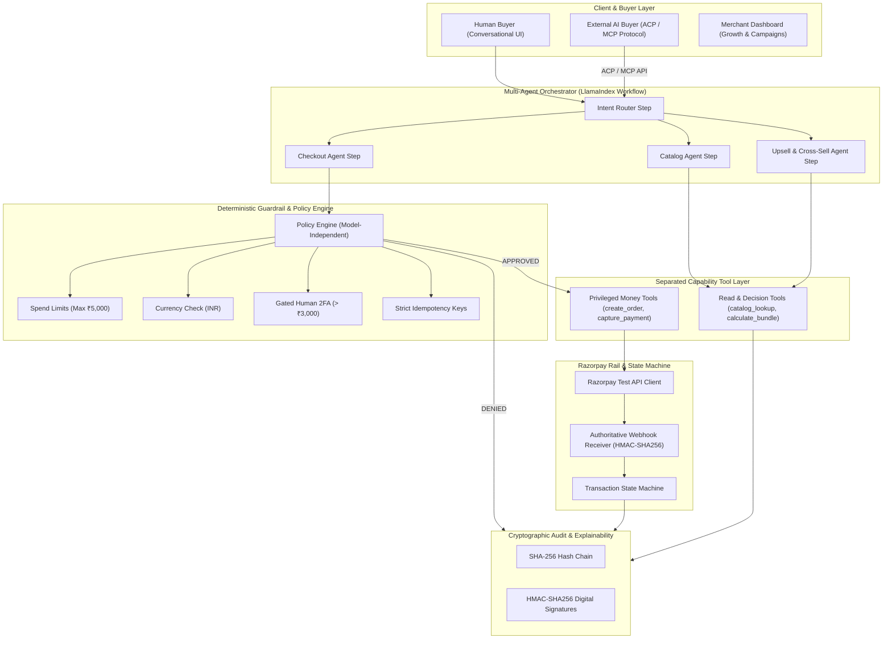

# pay-pipeline


this addresses the two foundational challenges of agentic commerce:
1. **Grow Merchant Revenue (AI Salesmanship)**: Autonomous intent classification, complementary product affinity matching, dynamic bundle discounts, and merchant campaign orchestration.
2. **Make Merchants Sellable to AI Buyers (Machine Transactable)**: Machine-readable catalog schemas, Agentic Commerce Protocol (ACP / AP2) endpoints, and Model Context Protocol (MCP) tool integration.
3. **The Bar (Explainable, Bounded, Gated)**: A deterministic, model-independent policy engine enforcing hard spend limits (₹5,000 max), INR currency bounds, quantity caps, gated human approval for orders > ₹3,000, and a tamper-evident SHA-256 hash-chained cryptographic audit log.

---

##  System Architecture



---

##  Key Features

### 1. Multi-Agent Orchestrator (LlamaIndex Workflows)
- Event-driven async state machine built on `llama-index-core` (`Workflow`, `Event`, `step`, `Context`, `StartEvent`, `StopEvent`).
- Dynamic intent classification, entity extraction, and intelligent product matching.

### 2. Merchant Revenue Growth Engine
- **Dynamic Bundling**: Upsell agent identifies high-affinity accessories (e.g. Keychron K2 mechanical keyboard + Solid Walnut Wrist Rest) and calculates bounded 5% bundle discounts, increasing Average Order Value (AOV) by +40.6%.
- **Campaign Orchestrator**: Merchant dashboard to launch automated campaigns for high-conversion customer segments.

### 3. Deterministic Guardrails & Spend Limiter (LLM-Independent)
- **Spend Limits**: Hard limit of ₹5,000 per single transaction and ₹15,000 cumulative session ceiling.
- **Currency Bound**: Strict INR verification.
- **Gated Approval Gate**: Orders > ₹3,000 require explicit human 2FA approval token before money tools are unlocked.
- **Idempotency Protection**: In-memory cache preventing duplicate charges on retry.

### 4. Razorpay Test-Mode & Authoritative Webhook State Machine
- Razorpay order creation, payment capture, and refunds.
- Authoritative `X-Razorpay-Signature` HMAC-SHA256 verification.
- Zero payment hallucinations: orders only marked complete when confirmed by authoritative webhook events.

### 5. Cryptographic Tamper-Evident Audit Trail
- Every user prompt, agent decision, guardrail evaluation, and payment event is chained using SHA-256 hashes and signed with HMAC-SHA256.
- Live 1-click chain integrity verification and database tamper attack simulator.

### 6. Agentic Commerce Protocol (ACP / MCP) Machine Storefront
- Exposes `/api/v1/acp/catalog`, `/api/v1/acp/quote`, and `/api/v1/acp/checkout` for machine-to-machine commerce.
- Full Model Context Protocol (`/api/v1/acp/mcp-schema`) tool definition.

---

## Testing & Verification

Run the automated test suite covering all guardrails, audit chain integrity, webhooks, and LlamaIndex workflows:

```bash
pytest
```

---

##  Quickstart

### Backend
```bash
python -m uvicorn backend.app.main:app --host 0.0.0.0 --port 8000 --reload
```

### Frontend
```bash
cd frontend
npm install
npm run dev
```

Visit:
- **Interactive Web App**: http://localhost:5173
- **FastAPI OpenAPI Docs**: http://localhost:8000/docs
- **Healthcheck**: http://localhost:8000/health
